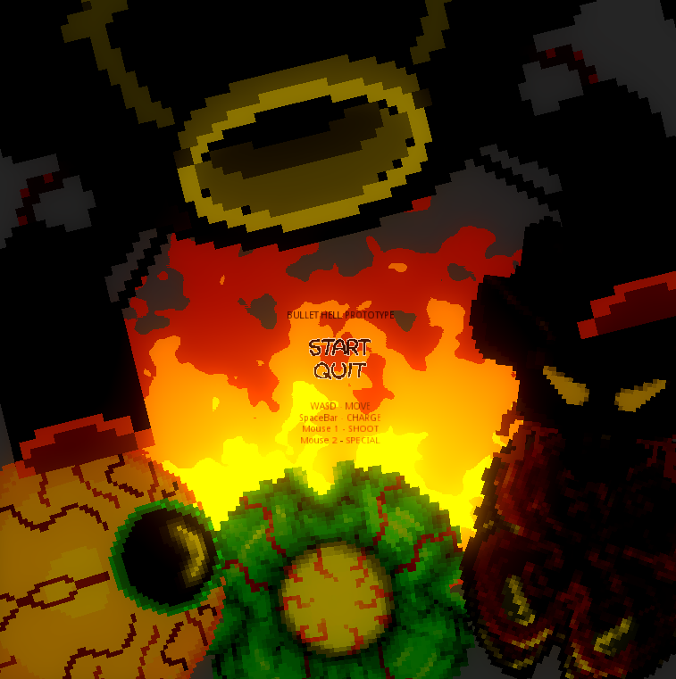

# Bullet Hell Prototype

Dive into the chaotic world of **Bullet Hell Prototype**, an exhilarating top-down shooter developed in Godot 3. With the motto "A bullet hell game where shooting bullets matter," this game offers a unique twist on the classic bullet hell genre. Engage in intense battles, shoot down enemy projectiles, and harness the power of collisions to enhance your firepower. Get ready to experience a fast-paced alien blend of arcade favorites like 1942!

## Table of Contents

- [Gameplay](#gameplay)
- [Features](#features)
- [Controls](#controls)
- [Screenshots](#screenshots)
- [Download](#download)
- [Contributing](#contributing)
- [License](#license)

## Gameplay

In **Bullet Hell Prototype**, precision and strategy are your allies. As you navigate through waves of enemies in a top-down view, you'll need to shoot down incoming bullets while avoiding collisions. The game's unique mechanic rewards players for hitting enemy bullets with their own shots. Each successful collision grants you power-ups, empowering your player with enhanced abilities and devastating firepower.

Prepare for epic boss battles at the end of each world, where your skills will be put to the ultimate test. Engage in intense shootouts, master the dash ability to navigate through tight situations, and collect power-ups dropped by defeated enemies.

## Features

- **Bullet Hell Innovation:** Turn enemy bullets into power-ups by skillfully colliding with them, enhancing your player's capabilities.

- **Classic Arcade Vibes:** Experience the nostalgia of classic arcade shooters like 1942, with a modern twist and a unique mechanic.

- **Dynamic Gameplay:** Navigate through waves of enemies, dodging bullets, and strategically using collisions to your advantage.

- **Epic Boss Battles:** Prove your skills in challenging boss encounters that require precise timing and strategic thinking.

- **Mouse, Keyboard, and Joystick Support:** Play the game your way, whether it's with a mouse and keyboard or a joystick.

- **Dash Ability:** Utilize the dash ability to evade bullets, repel enemies, and navigate tricky situations.

- **Power-Up Variety:** Collect power-ups dropped by enemies and use them to unleash devastating attacks on your foes.

## Controls

- **Mouse:** Aim by moving the mouse cursor.
- **Left Mouse Button:** Fire primary weapon.
- **Right Mouse Button:** Fire secondary weapon.
- **Spacebar:** Activate dash ability for evasive maneuvers.
- **Keyboard:** Use arrow keys or WASD to move the player.
- **Joystick:** Use the joystick to move the player and fire your weapon.

## Screenshots

*Dodge bullets, collide with enemies, and seize the power-ups!*

## Download

A compiled version of the game is available on [itch.io](https://surtarso.itch.io/bullet-hell-prototype). Get ready to embark on your bullet hell journey and experience the excitement firsthand!

## Contributing

We welcome contributions to enhance the game's experience further. If you have ideas, improvements, or bug fixes, don't hesitate to open an issue or submit a pull request. Let's collaborate to make this prototype even more incredible!

## License

This game is released under the [MIT License](LICENSE), allowing you to modify and distribute the game while giving credit to the original creators. Make sure to provide a link back to this repository when sharing your modifications.

---

Prepare for an explosive and strategic adventure in **Bullet Hell Prototype**! Turn enemy bullets into power-ups, engage in heart-pounding battles, and dominate the skies. Download the game from [itch.io](https://surtarso.itch.io/bullet-hell-prototype) and experience the adrenaline rush for yourself!

##### [Play me on a browser!](https://tarsogalvao.ddns.net/games/bullethell) (not optmized for browsers.)
